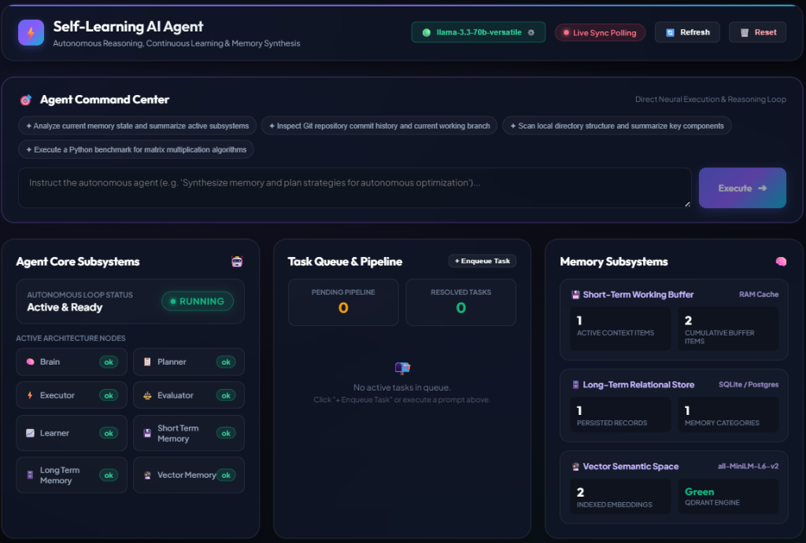
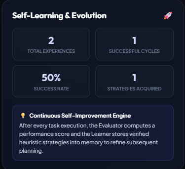
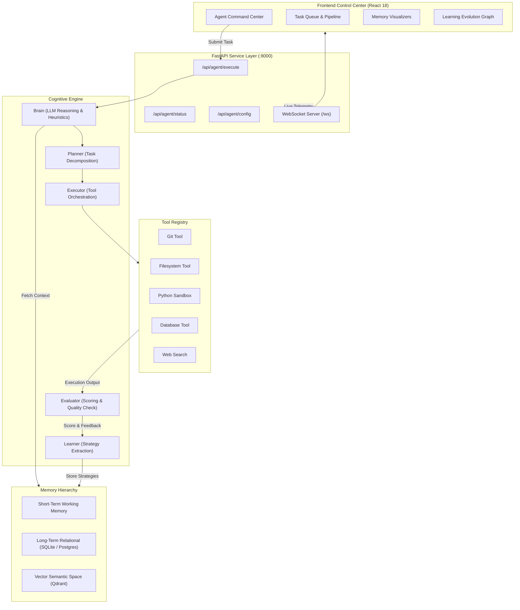

# 🧠 Self-Learning AI Agent

<div align="center">


**An autonomous AI system that reasons, plans, executes tools, evaluates its own performance, and self-evolves across iterations using multi-tiered memory architectures.**

[Live Dashboard](#-cyber-glassmorphic-dashboard) • [Quick Start](#-quick-start) • [Architecture](#-core-architecture) • [Memory Systems](#-multi-tiered-memory-hierarchy) • [Free LLM Setup](#-flexible-llm-providers--free-tier-support) • [API Docs](#-api-endpoints)

---

</div>

## 🌟 Overview Showcase

<div align="center">
  
  <p><em>Real-Time Cyber-Glassmorphic Control Center: Autonomous Prompt Runner, Subsystem Telemetry, Pipeline Queue, and Live Memory Gauges</em></p>
</div>

Unlike standard static chatbot wrappers, the **Self-Learning AI Agent** implements a closed-loop cognitive feedback system. Whenever given a task, it:
1. **Deconstructs & Formulates**: Synthesizes relevant context from short-term memory, relational storage, and semantic vector embeddings.
2. **Executes Real-World Tools**: Accesses the local filesystem, Git repositories, sandboxed Python interpreters, databases, and web search engines.
3. **Self-Evaluates & Reflects**: Quantifies completeness, accuracy, and efficiency using automated rubrics.
4. **Learns & Adapts**: Derives behavioral strategies from successful and failed outcomes, caching insights to permanently improve future performance.

---

## 📸 Self-Evolution & Continuous Learning

<div align="center">
  
  <p><em>Self-Improvement Telemetry: Real-time tracking of success rates, acquired strategies, and historical experience vectors</em></p>
</div>

---

## ⚡ Core Features

- 🔄 **Closed-Loop Cognitive Cycle**: Full `Reason -> Plan -> Act -> Evaluate -> Reflect -> Learn` feedback loop.
- 🧠 **Multi-Tiered Memory Subsystems**:
  - **Short-Term Context**: In-memory working buffer for conversational coherence.
  - **Long-Term Relational Store**: SQLite & PostgreSQL persistence for historical tasks, importance metrics, and categorical indexing.
  - **Vector Semantic Space**: Qdrant vector database utilizing `sentence-transformers/all-MiniLM-L6-v2` (384-dimensional embeddings) for contextual similarity search.
- 🛠️ **Built-in Tool Ecosystem**:
  - **Git Tool**: Inspect branches, commit history, working tree status, and diffs.
  - **Filesystem Tool**: Safe path traversal, file read/write, and directory tree synthesis.
  - **Python Sandbox**: Isolated runtime for mathematical, data processing, and scripting tasks.
  - **Database Tool**: Direct relational schema inspection and SQL querying.
  - **Web Search**: DuckDuckGo & SearX integration.
- 🌐 **Dynamic LLM Engine (Free & Cloud)**:
  - **Groq Cloud**: Ultra-low latency reasoning (< 2s) with `openai/gpt-oss-120b` or `llama-3.3-70b-versatile`.
  - **Google Gemini**: Free tier via Google AI Studio (`gemini-1.5-flash`).
  - **Ollama / Local**: 100% offline, zero-key private execution.
  - **Autonomous Heuristic Fallback**: Runs completely free using internal heuristic reasoning if no cloud API key is configured.
  - **OpenAI & Anthropic**: Native support for `gpt-4o`, `gpt-4-turbo`, and `claude-3-5-sonnet`.
- 📊 **Next-Gen Cyber-Glassmorphic UI**:
  - Direct **Agent Command Center** for executing prompts with pre-baked suggestions.
  - Task Queue with inline priority queuing modal (`High`, `Medium`, `Low`).
  - Live system telemetry with dual WebSocket & sync polling fallback.
  - On-the-fly AI model configuration modal (switch keys or models without restarting).
- 📦 **Zero-Docker Standalone Fallback**: Automatically defaults to SQLite (`sqlite:///./self_learning_agent.db`) and in-memory Qdrant if external database containers are offline.

---

## 🏗️ Core Architecture



---

## 🚀 Quick Start

### Prerequisites
- **Node.js** ≥ 18
- **Python** ≥ 3.11 (Tested up to Python 3.14 on Windows, Linux, and macOS)
- **Git**

### 1. Clone the Repository
```bash
git clone https://github.com/Prachethsingh/self-learning-AI-agent.git
cd self-learning-agent
```

### 2. Install Dependencies
```bash
# Install root orchestration & frontend dependencies
npm run install:all

# Install Python requirements
pip install -r requirements.txt
```

### 3. Launch with One Command
Run the complete stack (FastAPI backend + React frontend) simultaneously:
```bash
npm start
```

Your system will automatically spin up:
- 🌐 **Dashboard UI**: [http://localhost:3000](http://localhost:3000)
- ⚙️ **FastAPI Backend & Interactive Swagger**: [http://localhost:8000/docs](http://localhost:8000/docs)

---

## 🔑 Flexible LLM Providers & Free-Tier Support

The system can operate with zero external API keys out-of-the-box, or connect to high-performance cloud models in seconds.

### Method A: Configure via the Web Dashboard
1. Open [http://localhost:3000](http://localhost:3000)
2. Click the **`⚡ Autonomous Mode ⚙️`** badge in the header.
3. Select any provider preset (e.g., **Groq Cloud**, **Google Gemini**, **Ollama**, or **OpenAI**).
4. Paste your key and click **Save & Activate**—the live agent re-initializes immediately without server restarts!

### Method B: Configure via `.env`
Edit the local [`.env`](file:///c:/Users/pachu/Downloads/self-learning-agent/.env) file:

#### 🚀 Groq Cloud (Free & Ultra-Fast < 2s)
Get a free key in 30 seconds with no credit card at [console.groq.com/keys](https://console.groq.com/keys):
```env
OPENAI_API_KEY=gsk_your_groq_api_key_here
LLM_BASE_URL=https://api.groq.com/openai/v1
LLM_MODEL=openai/gpt-oss-120b
```

#### ✨ Google Gemini (Free 1,500 req/day)
Get a free key at [aistudio.google.com/app/apikey](https://aistudio.google.com/app/apikey):
```env
OPENAI_API_KEY=AIzaSy_your_gemini_key_here
LLM_BASE_URL=https://generativelanguage.googleapis.com/v1beta/openai/
LLM_MODEL=gemini-1.5-flash
```

#### 💻 Ollama (100% Free & Local)
Install from [ollama.com](https://ollama.com):
```env
OPENAI_API_KEY=ollama
LLM_BASE_URL=http://localhost:11434/v1
LLM_MODEL=llama3.2
```

#### ⚡ Built-in Autonomous Engine (Zero Config)
Leave `OPENAI_API_KEY` blank. The agent runs fully offline, utilizing local deterministic reasoning and tool loops.

---

## 🧠 Multi-Tiered Memory Hierarchy

| Memory Tier | Storage Backend | Purpose | Retrieval Method |
|---|---|---|---|
| **Short-Term Memory** | In-Memory Ring Buffer | Immediate session continuity, dialog turns, prompt history | Session ID + LRU query |
| **Long-Term Memory** | SQLite (`self_learning_agent.db`) / Postgres | Retaining verified solutions, strategic milestones, code summaries | Category tags, importance weight |
| **Vector Memory** | Qdrant (or In-Memory fallback) | Cross-task semantic association and analogous experience lookups | Cosine similarity via `all-MiniLM-L6-v2` |

---

## 🔌 API Endpoints

Explore and test all endpoints via the interactive Swagger UI at `http://localhost:8000/docs`:

### Agent Execution & Lifecycle
- `POST /api/agent/execute` — Submit a task to the agent cognitive loop.
  ```json
  {
    "task": "Analyze git commits and list repository status"
  }
  ```
- `GET /api/agent/status` — Retrieve comprehensive health and learning metrics.
- `GET /api/agent/config` — View active model, provider, base URL, and masked API key.
- `POST /api/agent/config` — Dynamically reconfigure provider, model, base URL, or API key.
- `POST /api/agent/reset` — Clear running state and memory buffers.

### Memory & Task Pipeline
- `GET /api/memory/stats` — Detailed memory allocation across all three tiers.
- `GET /api/tasks/` — List active, pending, and completed pipeline tasks.
- `POST /api/tasks/` — Queue a new task into the background execution pipeline.
- `GET /ws` — Real-time bidirectional WebSocket telemetry feed.

---

## 📁 Project Directory Structure

```text
self-learning-agent/
├── agent/                   # Cognitive core modules
│   ├── brain.py             # LLM reasoning, heuristic fallback & reflection
│   ├── planner.py           # Task decomposition & plan formulation
│   ├── executor.py          # Tool invocation & safety handling
│   ├── evaluator.py         # Multi-criteria scoring (completeness, accuracy)
│   └── learner.py           # Experience repository & strategy extraction
├── api/                     # Backend API layer
│   ├── main.py              # FastAPI app lifecycle & tool bootstrap
│   ├── websocket.py         # Real-time WebSocket connection manager
│   ├── security.py          # CORS, headers & token validation
│   └── routes/              # Modular API routers (agent, memory, tasks)
├── database/                # Relational models & SQLAlchemy schemas
├── docs/                    # Architectural diagrams & screenshots
│   └── images/              # High-res dashboard visual assets
├── frontend/                # React 18 Cyber-Glassmorphic Dashboard
│   ├── public/              # Static HTML & Google Fonts integration
│   └── src/
│       ├── components/      # UI panels (Command Center, Queue, Memory, Learning)
│       ├── hooks/           # useWebSocket live syncing hook
│       ├── App.js           # Core layout, state & LLM settings modal
│       └── App.css          # Cyber-dark design system & glassmorphism
├── memory/                  # Multi-tiered storage engines
│   ├── short_term.py        # RAM ring buffer
│   ├── long_term.py         # SQLite / PostgreSQL persistence
│   └── vector_memory.py     # Qdrant vector space & embedding generator
├── tools/                   # Extensible agent tools
│   ├── filesystem.py        # Safe file & directory operations
│   ├── git_tool.py          # Git repository inspector
│   ├── python_tool.py       # Isolated Python execution runtime
│   ├── database.py          # Relational SQL diagnostic tool
│   └── web_search.py        # DuckDuckGo & search engine client
├── package.json             # Root orchestration (concurrently runner)
├── requirements.txt         # Python dependencies
└── .env                     # Local environment & LLM configuration
```

---

## 🤝 Contributing

Contributions, feedback, and pull requests are welcome!
1. Fork the repository
2. Create your feature branch (`git checkout -b feat/amazing-feature`)
3. Commit your changes (`git commit -m 'Add amazing feature'`)
4. Push to the branch (`git push origin feat/amazing-feature`)
5. Open a Pull Request

---

## 📜 License

Distributed under the **MIT License**. See `LICENSE` for more information.

---

<div align="center">
  <sub>Built with ❤️ by <a href="https://github.com/Prachethsingh">Pracheth Singh</a>. Powered by FastAPI, React, Qdrant, and Groq.</sub>
</div>